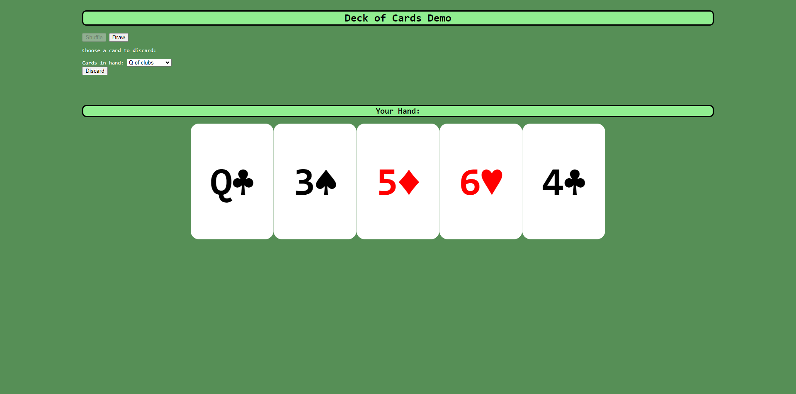

# Dynamic Cards Demo

## Description

I wanted to build upon the Deck of Cards demo by generating cards dynamically instead of using stock images for all cards. Though there are a lot of similarities between these 2 demos, I was able to print card data (values and suits) onto the cards themselves and only needed to source the blank cards for use as a "canvas" of sorts.

## Installation

You can access this page with the following URL: https://jmcmillenmusic.github.io/dynamic-cards-demo/

## Usage

Click on the Shuffle button first to shuffle the deck. Then, click on the Draw button to draw a card. You'll see all of the cards you've drawn so far in the "Your Hand" section. To discard a card, choose a card from the dropdown menu and click on the Discard button. The image of the card you discarded goes away.

## Credits

N/A

## License

This project uses the MIT License.